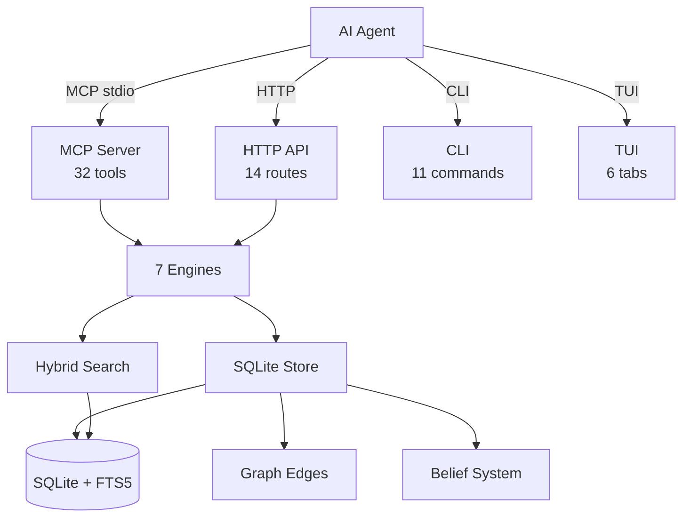

<div align="center">


# 🦀 The Crab Engram

**Persistent memory for AI coding agents — rewritten in Rust.**

[](https://www.rust-lang.org/)
[](LICENSE)
[]()
[]()

*A Rust rewrite of [engram](https://github.com/Gentleman-Programming/engram) with 7 auto-learning engines, encryption, multi-agent permissions, and graph-based knowledge.*

[Features](#features) • [Quick Start](#quick-start) • [Architecture](#architecture) • [MCP Tools](#mcp-tools) • [API](#api) • [Docs](docs/en/overview.md)

</div>

---

## Why The Crab Engram?

Your AI coding agent forgets everything when the session ends. **The Crab Engram** gives it a brain — with auto-learning.

Unlike simple CRUD memory stores, The Crab Engram has **7 engines** that observe how your agent works and automatically consolidate knowledge, detect anti-patterns, synthesize capsules, track beliefs, and space out reviews.

```
Agent (Claude Code / Cursor / OpenCode / Codex / VS Code / ...)
    ↓ MCP stdio (32 tools)
The Crab Engram (single Rust binary)
    ↓
┌─────────────────────────────────────────────┐
│  7 Auto-Learning Engines                    │
│  ┌──────────────┐ ┌──────────────┐          │
│  │Consolidation │ │Anti-Pattern  │          │
│  │ Engine       │ │ Detector     │          │
│  └──────────────┘ └──────────────┘          │
│  ┌──────────────┐ ┌──────────────┐          │
│  │Smart Injector│ │Boundary      │          │
│  │ (compaction) │ │ Tracker      │          │
│  └──────────────┘ └──────────────┘          │
│  ┌──────────────┐ ┌──────────────┐          │
│  │Capsule       │ │Stream        │          │
│  │ Builder      │ │ Engine       │          │
│  └──────────────┘ └──────────────┘          │
│  ┌──────────────┐                           │
│  │Graph Evolver │                           │
│  └──────────────┘                           │
├─────────────────────────────────────────────┤
│  SQLite + FTS5 + Graph Edges + Beliefs      │
└─────────────────────────────────────────────┘
```

---

## Features

### Core Memory

| Feature | Description |
|---|---|
| **Observations** | Save, search, update, delete with FTS5 full-text search |
| **Graph Edges** | Temporal relationships (supersedes, depends_on, contradicts) |
| **Beliefs** | State machine: Active → Confirmed → Contested with evidence tracking |
| **Knowledge Capsules** | Auto-synthesized topic summaries from observations |
| **Knowledge Boundaries** | Domain confidence tracking (novice → expert) |
| **Decay Scoring** | Recency + frequency + lifecycle-aware ranking |
| **Episodic/Semantic** | Auto-classification of memories into temporal vs factual |

### Auto-Learning Engines

| Engine | What it does |
|---|---|
| 🔄 **Consolidation** | Finds duplicates (semantic + hash), marks obsolete, detects conflicts |
| ⚠️ **Anti-Pattern Detector** | Hotspot files, unverified decisions, recurring bugfixes |
| 💉 **Smart Injector** | Context injection with compaction-aware token budgets |
| 🗺️ **Boundary Tracker** | Tracks what the agent knows well vs poorly per domain |
| 💊 **Capsule Builder** | Synthesizes knowledge capsules from observations |
| 🌊 **Stream Engine** | Real-time event detection (file context, entities, deja vu) |
| 🌱 **Graph Evolver** | Temporal patterns, file correlations, new edge detection |

### Infrastructure

| Feature | Description |
|---|---|
| 🔐 **Encryption** | ChaCha20-Poly1305 with passphrase-derived keys |
| 👥 **Multi-Agent** | Permission engine with Agent/Admin/All profiles |
| 🔄 **CRDT Sync** | LWW register, chunk export/import, conflict resolution |
| 📊 **199 Tests** | 0 failures, 0 warnings across 8 crates |
| 🏗️ **SDD** | 277 tasks, full Spec-Driven Development cycle |

---

## Quick Start

```bash
# Build
git clone https://github.com/maisonnat/the-crab-engram.git
cd the-crab-engram
cargo build --release

# Start MCP server (for AI agents)
./target/release/engram mcp

# Start HTTP API
./target/release/engram serve

# Launch TUI
./target/release/engram tui

# CLI search
./target/release/engram search "auth implementation"
```

---

## Architecture

```
crates/
├── core/       → Domain model: Observation, Edge, Belief, Capsule, Boundary, crypto, scoring
├── store/      → SQLite + FTS5 storage (35 trait methods), migrations, graph, beliefs
├── search/     → Embedder, hybrid search (Reciprocal Rank Fusion), cosine similarity
├── learn/      → 7 auto-learning engines
├── mcp/        → MCP server (stdio) — 32 tools, 3 resources, stream events
├── api/        → HTTP API (Axum) — 14 routes
├── sync/       → CRDT LWW, chunk export/import, conflict resolution
└── tui/        → Terminal UI (Ratatui) — 6 tabs
```



---

## MCP Tools

<details>
<summary><b>32 tools available</b> (click to expand)</summary>

| Tool | Description |
|---|---|
| `mem_save` | Save observation with type, scope, topic |
| `mem_update` | Update observation fields |
| `mem_delete` | Soft/hard delete (Admin only) |
| `mem_search` | Full-text search with decay scoring |
| `mem_get_observation` | Get full content by ID |
| `mem_context` | Recent session context |
| `mem_timeline` | Chronological drill-in |
| `mem_stats` | Memory statistics |
| `mem_save_prompt` | Save user prompt |
| `mem_session_start` | Register session start |
| `mem_session_end` | Mark session complete |
| `mem_session_summary` | End-of-session structured save |
| `mem_capture_passive` | Extract learnings from text output |
| `mem_capture_git` | Capture git commit as observation with GitCommit + CodeDiff |
| `mem_capture_error` | Capture compilation/test error with ErrorTrace |
| `mem_suggest_topic_key` | Stable key for evolving topics |
| `mem_merge_projects` | Merge project name variants (Admin) |
| `mem_consolidate` | Run consolidation engine |
| `mem_antipatterns` | Detect anti-patterns |
| `mem_inject` | Smart context injection for a task |
| `mem_synthesize` | Synthesize knowledge capsule |
| `mem_capsule_list` | List all knowledge capsules |
| `mem_capsule_get` | Get full capsule with decisions, issues, patterns |
| `mem_knowledge_boundary` | Compute/list knowledge boundaries |
| `mem_stream` | Real-time memory events (5 modes) |
| `mem_reviews` | Pending spaced repetition reviews |
| `mem_beliefs` | Query beliefs about a subject |
| `mem_sync` | Sync operations (status/export/import) |
| `mem_relate` | Add typed graph edge between observations |
| `mem_graph` | Get graph data for visualization |
| `mem_open_graph` | Open graph visualization |
| `mem_pin` | Pin/unpin observation — pinned gets maximum relevance |
| `mem_transfer` | Transfer observations between projects |

</details>

---

## API

```bash
# Start server
engram serve --port 7437

# CRUD
POST   /observations          # Create
GET    /observations           # List (with ?q= search)
GET    /observations/:id       # Get
PUT    /observations/:id       # Update
DELETE /observations/:id       # Delete

# Search & Context
POST   /search                 # Full-text search
GET    /context                # Recent context
GET    /stats                  # Statistics
GET    /export                 # Export JSON
POST   /import                 # Import JSON

# F2+ Features
POST   /consolidate            # Run consolidation
GET    /capsules               # List knowledge capsules
GET    /capsules/:topic        # Get capsule by topic
GET    /graph/:id              # Get edges for observation
POST   /inject                 # Smart context injection
GET    /antipatterns           # Detect anti-patterns

# Sessions
POST   /sessions               # Create session
GET    /sessions/:id           # Get session
```

Full OpenAPI spec: [`docs/openapi.yaml`](docs/openapi.yaml)

---

## TUI

```
engram tui
```

| Key | Action |
|---|---|
| `1` | Dashboard |
| `2` | Search |
| `3` | Capsules |
| `4` | Boundaries |
| `j/k` | Navigate |
| `Enter` | Drill in |
| `Esc` | Back |

---

## Documentation

| Doc | Description |
|---|---|
| [Overview](docs/en/overview.md) | Project intro and capabilities |
| [Architecture](docs/en/architecture.md) | 8-crate structure, diagrams, patterns |
| [API Reference](docs/en/api.md) | HTTP routes, MCP tools, CLI commands |
| [Data Models](docs/en/data-models.md) | Entities, Storage trait, schema |
| [Setup](docs/en/setup.md) | Build, run, test |
| [User Guide](docs/en/user-guide.md) | Workflows and examples |
| [Security](docs/en/security-posture.md) | Encryption, permissions, audit |
| [Changelog](docs/en/changelog.md) | v2.0.0 features |

---

## Comparison

| Feature | engram (Go) | mem0 (Python) | **The Crab Engram** 🦀 |
|---|---|---|---|
| MCP Server | ✅ 15 tools | ❌ | ✅ **32 tools** |
| Auto-Learning | ❌ | ❌ | ✅ **7 engines** |
| Encryption | ❌ | ❌ | ✅ **ChaCha20** |
| Multi-Agent | ❌ | ❌ | ✅ **Permissions** |
| Graph Edges | ❌ | ❌ | ✅ **Temporal** |
| Belief System | ❌ | ❌ | ✅ **State machine** |
| Vector Search | ❌ | ✅ | ⚠️ (stubs) |
| Managed Service | ❌ | ✅ | ❌ |

---

## Contributing

Built with [Spec-Driven Development](openspec/). See [openspec/specs/engram-wiring/spec.md](openspec/specs/engram-wiring/spec.md) for the full specification.

```bash
# Run tests
cargo test --workspace

# Check warnings (should be 0)
cargo check --workspace

# Run linter
cargo clippy --workspace
```

---

## License

[MIT](LICENSE) — Built with 🦀

---

<div align="center">

## Acknowledgments

Inspired by [engram](https://github.com/Gentleman-Programming/engram) — the original Go implementation that proved persistent memory for AI agents works.
Thanks to the Gentleman Programming community for the ideas, architecture patterns, and the vision of giving AI agents a brain.

🦀

</div>
