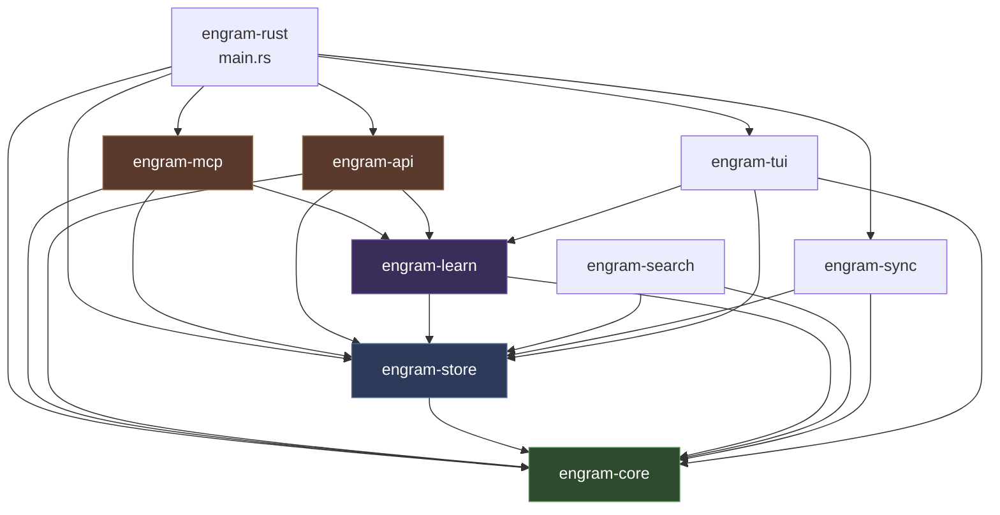
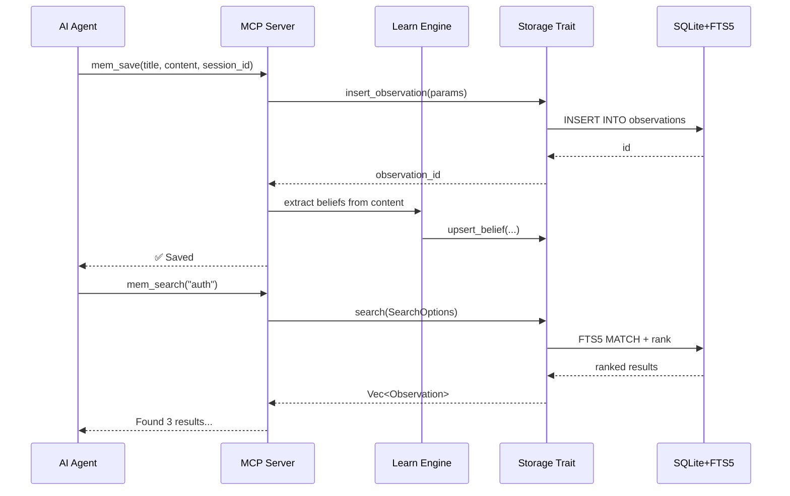

# Engram-Rust — Architecture

## Workspace Structure

```
engram-rust/
├── Cargo.toml              # Workspace root (resolver v3)
├── src/
│   └── main.rs             # CLI entry point (15 subcommands)
├── crates/
│   ├── core/               # engram-core — Domain types, no IO
│   │   └── src/
│   │       ├── lib.rs      # 18 public modules
│   │       ├── observation.rs   # Observation, ObservationType, Scope, ProvenanceSource, LifecycleState
│   │       ├── graph.rs         # Edge, RelationType (temporal knowledge graph)
│   │       ├── session.rs       # Session, SessionSummary
│   │       ├── capsule.rs       # KnowledgeCapsule (dense topic synthesis)
│   │       ├── belief.rs        # Belief, BeliefState, BeliefOperation (state machine)
│   │       ├── boundary.rs      # KnowledgeBoundary, ConfidenceLevel
│   │       ├── attachment.rs    # Attachment (CodeDiff, TerminalOutput, ErrorTrace, GitCommit)
│   │       ├── crypto.rs        # ChaCha20Poly1305 encrypt/decrypt/derive_key
│   │       ├── permissions.rs   # PermissionEngine, AccessLevel, PermissionRule
│   │       ├── entity.rs        # Entity, EntityType, extract_entities
│   │       ├── compaction.rs    # CompactionLevel, determine_level
│   │       ├── memory.rs        # EpisodicMemory, SemanticMemory, classify_query_type
│   │       ├── salience.rs      # MemorySalience
│   │       ├── score.rs         # decay_score, compute_final_score
│   │       ├── lifecycle.rs     # LifecyclePolicy
│   │       ├── stream.rs        # MemoryEvent, EventThrottle, ExtractedEntity
│   │       ├── topic.rs         # suggest_topic_key, slugify
│   │       └── error.rs         # EngramError (unified error type)
│   │
│   ├── store/              # engram-store — Storage trait + SQLite impl
│   │   └── src/
│   │       ├── lib.rs
│   │       ├── trait.rs         # Storage trait (35 methods), ExportData, ProjectStats, etc.
│   │       ├── sqlite.rs        # SqliteStore — Mutex<Connection>, all trait methods
│   │       ├── params.rs        # AddObservationParams, SearchOptions, etc.
│   │       ├── migration.rs     # Migration runner (13 migrations, idempotent)
│   │       └── migrations/
│   │           ├── 001_initial.sql          # sessions, observations, prompts
│   │           ├── 002_fts.sql             # observations_fts (FTS5 virtual table)
│   │           ├── 003_vectors.sql         # observation_embeddings
│   │           ├── 004_graph.sql           # edges (temporal graph)
│   │           ├── 006_capsules.sql        # knowledge_capsules
│   │           ├── 007_cross_project.sql   # knowledge_transfers
│   │           ├── 008_episodic_semantic.sql
│   │           ├── 009_review_schedule.sql # review_schedule (spaced repetition)
│   │           ├── 011_attachments.sql     # observation_attachments
│   │           ├── 012_boundaries.sql      # knowledge_boundaries
│   │           ├── 013_agent_personalities.sql
│   │           ├── 015_beliefs.sql         # beliefs
│   │           └── 016_entities.sql        # entities, entity_observations
│   │
│   ├── mcp/                # engram-mcp — MCP protocol server
│   │   └── src/
│   │       ├── lib.rs
│   │       ├── server.rs        # EngramServer, EngramConfig, ToolProfile, ServerHandler impl
│   │       └── tools/
│   │           └── mod.rs       # 31 tool definitions + dispatch + handlers
│   │
│   ├── api/                # engram-api — HTTP REST API
│   │   └── src/
│   │       └── lib.rs           # 14 Axum routes, AppState, request/response types
│   │
│   ├── learn/              # engram-learn — Auto-learning engines
│   │   └── src/
│   │       ├── lib.rs
│   │       ├── consolidation.rs     # ConsolidationEngine (duplicates, obsolete, conflicts)
│   │       ├── capsule_builder.rs   # CapsuleBuilder, HeuristicSynthesizer, ChainedSynthesizer
│   │       ├── smart_injector.rs    # SmartInjector (context injection)
│   │       ├── anti_pattern.rs      # AntiPatternDetector (recurring bugs, hotspots)
│   │       ├── stream_engine.rs     # MemoryStream (file context, deja-vu, anti-patterns)
│   │       ├── graph_evolver.rs     # GraphEvolver (auto-detect edges)
│   │       ├── boundary_tracker.rs  # BoundaryTracker (knowledge gaps)
│   │       ├── salience_infer.rs    # infer_salience (emotional valence, surprise)
│   │       └── spaced_review.rs     # SpacedRepetition (SM-2 algorithm)
│   │
│   ├── search/             # engram-search — Hybrid search engine
│   │   └── src/
│   │       ├── lib.rs
│   │       ├── embedder.rs      # Embedder, EmbeddingMeta (text embeddings)
│   │       └── hybrid.rs        # compute_relevance_score, reciprocal_rank_fusion
│   │
│   ├── sync/               # engram-sync — CRDT sync protocol
│   │   └── src/
│   │       ├── lib.rs
│   │       ├── crdt.rs          # CrdtState, SyncStatus, conflict resolution
│   │       └── chunk.rs         # export_chunks, import_chunks, ChunkManifest
│   │
│   └── tui/                # engram-tui — Terminal UI
│       └── src/
│           ├── lib.rs           # run_tui (crossterm event loop)
│           └── app.rs           # App, AppState, draw (Ratatui rendering)
│
├── tests/
│   └── integration_store.rs    # Full store flow integration tests
├── plugins/                    # Git hook scripts
├── openspec/                   # SDD change specs
└── sdd/                        # SDD configuration
```

## Module Dependency Graph



**Dependency rules:**
- `engram-core` has ZERO external dependencies (only serde, chrono, uuid, sha2, chacha20poly1305)
- `engram-store` depends only on `engram-core` + `rusqlite`
- `engram-learn` depends on `engram-core` + `engram-store` (via Storage trait)
- `engram-mcp` depends on `engram-core` + `engram-store` + `engram-learn`
- `engram-api` depends on `engram-core` + `engram-store` + `engram-learn`

## Data Flow



## Design Patterns

### 1. Hexagonal Architecture (Ports & Adapters)

The `Storage` trait (`crates/store/src/trait.rs`) is the **central port** — a 35-method interface that completely isolates domain logic from persistence:

```rust
pub trait Storage: Send + Sync {
    fn insert_observation(&self, params: &AddObservationParams) -> Result<i64>;
    fn search(&self, opts: &SearchOptions) -> Result<Vec<Observation>>;
    fn add_edge(&self, params: &AddEdgeParams) -> Result<i64>;
    // ... 32 more methods
}
```

**Rules enforced:**
- ALL return types are from `engram-core` (no rusqlite types leak)
- ALL parameters are structs (no raw SQL strings)
- ALL errors are `EngramError` (no `rusqlite::Error`)
- NO `raw_query` or `get_connection` methods

This means you can swap `SqliteStore` for Postgres, DynamoDB, or any backend by implementing the `Storage` trait.

### 2. Trait-Based Abstraction

Every major subsystem uses trait-based dispatch:
- `Storage` — persistence backend
- `ToolProfile` — tool access control (Agent/Admin/All)
- `ConsolidationEngine` — uses `Arc<dyn Storage>`
- `SmartInjector` — uses `Arc<dyn Storage>`
- `AntiPatternDetector` — uses `Arc<dyn Storage>`

### 3. Container-Presentational (TUI)

The TUI separates state (`App`) from rendering (`draw`):
- `App` holds all state: search results, capsules, boundaries, selected index
- `draw()` is a pure function that renders `App` state to Ratatui widgets
- Event handling in the loop mutates `App`, then the frame redraws

### 4. Builder/Factory Pattern

- `Observation::new()` — creates with smart defaults
- `Edge::new()` — creates temporal edge
- `KnowledgeCapsule::new()` — creates empty capsule
- `Belief::new()` — creates belief in Active state

## Entry Points

| Entry Point | File | Command |
|---|---|---|
| CLI (all commands) | `src/main.rs` | `the-crab-engram <subcommand>` |
| MCP Server | `crates/mcp/src/server.rs` | `the-crab-engram mcp --profile agent` |
| HTTP API | `crates/api/src/lib.rs` | `the-crab-engram serve --port 7437` |
| TUI | `crates/tui/src/lib.rs` | `the-crab-engram tui` |
| Tests | `tests/integration_store.rs` + per-crate `#[cfg(test)]` | `cargo test --workspace` |

## Concurrency Model

- `SqliteStore` wraps `Mutex<rusqlite::Connection>` — single-writer, serialized access
- MCP server uses `Arc<dyn Storage>` — thread-safe shared ownership
- Background auto-consolidation runs via `tokio::spawn` every 30 minutes
- Stream events delivered via `tokio::sync::mpsc` channel with 25ms throttle
